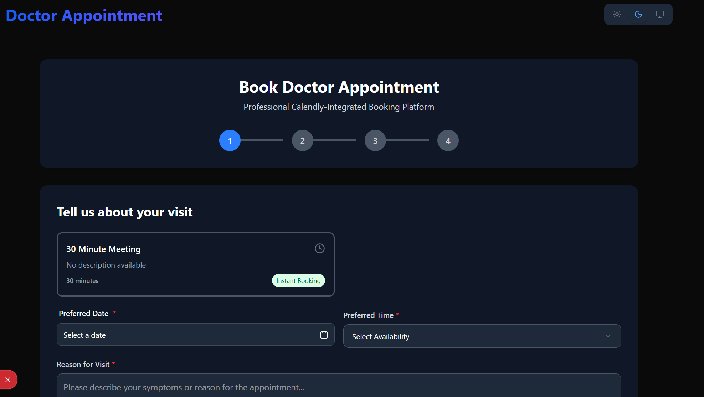
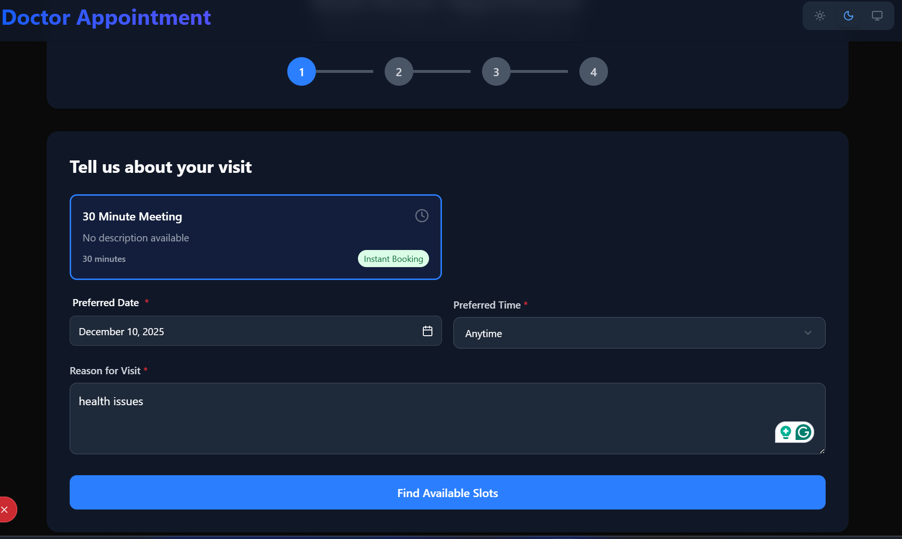
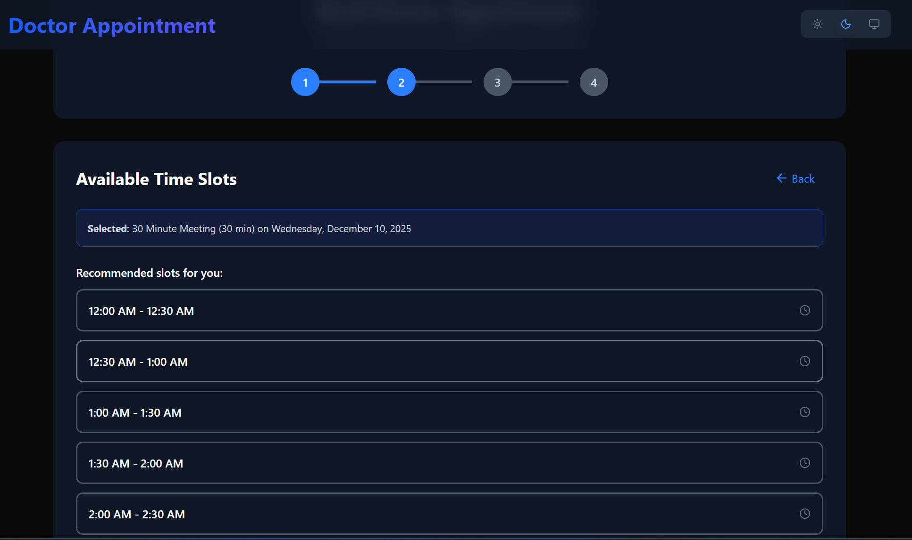
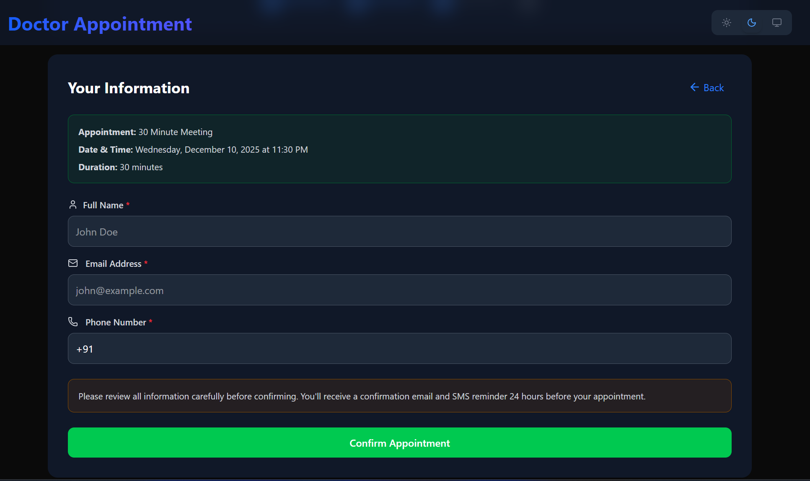
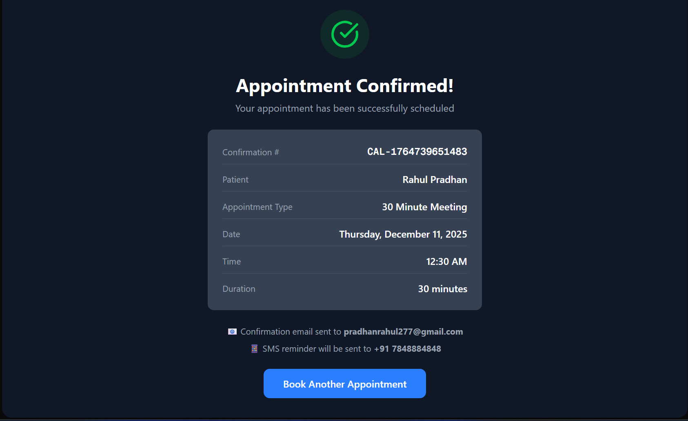
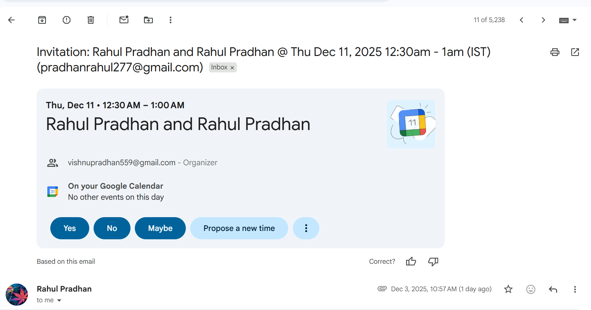

## Appointment Booking System
Below is a fully polished, production-ready **GitHub-style README** for your Appointment Booking System.
All images are referenced from the `public` folder, the formatting is clean, and the document is structured exactly how top GitHub repositories present their projects.

Copy-paste directly into your `README.md`.

---

# Appointment Booking System

A full-stack appointment and assessment scheduling system built using **Next.js** and **Calendly’s Scheduling API**.
This application allows users to select a doctor or assessment type, choose a date and time, enter personal details, and confirm their booking.
All scheduling operations are validated and executed through Calendly for accuracy and reliability.

---

## Features

* Modern Next.js frontend with a smooth multi-step booking flow
* Calendly API integration for real scheduling
* Input validation for name, email, phone, and reason
* Timezone-aware scheduling (`Asia/Kolkata`)
* API success and error handling
* Fully deployable on Vercel

---

## Tech Stack

* **Next.js 16+ (App Router)**
* **Node.js**
* **Calendly REST API**
* **Axios**
* **Tailwind CSS**

---

## Environment Variables

Create a `.env` file in the root directory:

```
CALENDLY_ACCESS_TOKEN=
CALENDLY_USER_URI=https://api.calendly.com/users/{id}
NEXT_PUBLIC_APP_URL=http://localhost:3000
```

---

## Getting Started

Install dependencies:

```bash
npm install
```

Start the development server:

```bash
npm run dev
```

Visit the app at:

```
http://localhost:3000
```

---

## Live Deployment

The application is deployed on Vercel:

[https://doctor-appointment-booking-orpin.vercel.app/](https://doctor-appointment-booking-orpin.vercel.app/)

---

## Booking Flow Screenshots

All images are served from the `public/` directory.

### Step 1: Home Page



---

### Step 2: Select Department / Assessment



---

### Step 3: Choose Date & Time



---

### Step 4: Enter Personal Information



---

### Step 5: Confirm Booking



### Conformation Mail

---

## API Overview

### POST `/api/schedule`

Schedules an appointment through Calendly.

#### Example Request

```json
{
  "eventTypeId": "b7c9f6eb-7420-429d-9687-bd288114a4b2",
  "name": "Rahul Pradhan",
  "email": "pradhanrahul227@gmail.com",
  "phone": "+91 7847747488",
  "reason": "Health issues",
  "startTime": "2025-12-10T20:00:00.000Z",
  "timezone": "Asia/Kolkata"
}
```

#### Example Response (Success)

```json
{
  "success": true,
  "message": "Appointment scheduled successfully.",
  "data": {
    "uri": "https://api.calendly.com/scheduled_events/{event-id}"
  }
}
```

#### Example Response (Error)

```json
{
  "success": false,
  "error": "Invalid parameters or unavailable time slot."
}
```

---

## Folder Structure

```
/app
  /api
    /schedule
      route.js
/public
  image.png
  image-1.png
  image-2.png
  image-3.png
  image-4.png
/utils
  calendly.js
.env
README.md
```

---

## License

This project is open-source and available under the MIT License.

---

